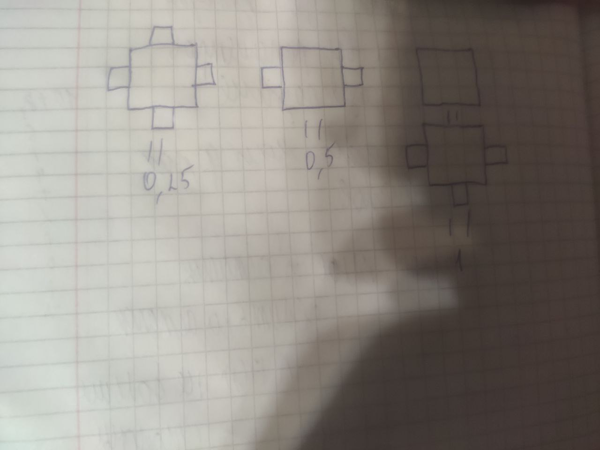
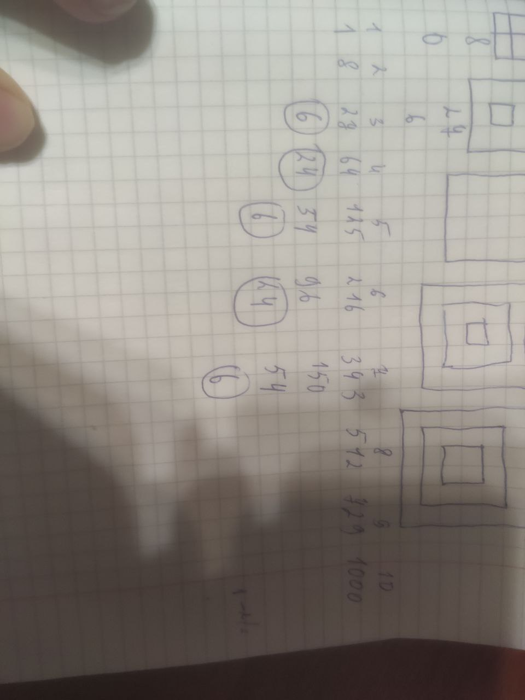

my idea is that it reveals symmetry
My idea is based on symmetry and my visual representation of squares. You can take not only squares, but also cubes, triangles, pyramids, and others. You can explore them, but please refer to me.
